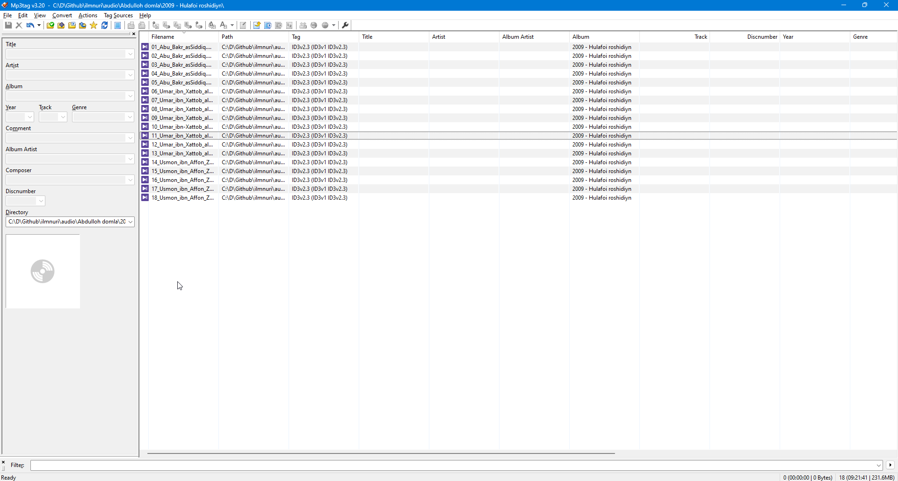

# Ilm Nuri
Ilmnuri sahifasidagi audiolarning metadatalarini tartib bilan saqlangan varianti. 

*Ilm nuri* android dasturidan foydalanganlar bo'lsa bilishadiki, dasturning sodda va barcha darslarni jamlanganligiga qaramasdan, ma'lum kamchiliklari mavjud. Bular:
- Dastur darslikni eshitib chiqib ketgandan so'ng qaytib kelgan paytda darslik qayerda qolganligini eslab qolmaydi
- Dastur bir darslikni eshitgandan so'ng shu mavzudagi keyingi darsni qo'yib keta olmaydi
- Eshitilgan darsliklarni ajratish yoki belgilash imkoniyati mavjud emas

# Afzalliklar

Shu kamchiliklarni hisobga olgan holatda, Ilmnuri darsliklaridan maksimal foydalanishni xohlovchilar uchun, darsliklarni tartib bilan kategoriyalab, har bir darslikni **metadatalarini** mos ravishda belgilab chiqdim. 

Bundan maqsad, endi bu darsliklar to'plami bilan, har bir foydalanuvchi, darslikni yuklab olgandan so'ng darsliklarni xohlagan media player orqali, ajratilgan album lar yordamida tartib bilan tinglashi mumkin bo'ladi. Eshitilgan darslikni eslab qolishga kelsak, media playerlar bunday qobiliyatga ega, va ular o'z kategoriyasida (playlistda) bo'lgan barcha darslarni ketma-ket qo'yib keta oladi.

Tavsiya qilingan media playerlar ro'yxati:
- AIMP
- Jet Audio
- Musicolet
- Samsung music
- Va har qanday telefonda mavjud media player:)

# Darslikni yuklash va o'rnatish

## 1) Barcha darslarni bir urinishda yuklash (size ~ 17GB)

[video](videolink)

## 2) Darslarni alohida bo'lib bo'lib yuklash

[video](videolink)

# Aloqa
  
 
# Contributions
Proyektga hissa qo'shishni xohlaganlar uchun ma'lum vazifalar mavjud. Bulardan
- Shukurulloh domla
- Abror Muxtor Aliy
- Sardor domla
- va boshqalar

Ustoslarimizni darslarini qo'shish niyat bo'lsa, audiolarni tartib bilan yig'ib, ularning metadatasini album bo'limi o'zgartirib, boshqa bo'limlarni tozalagan holatda, proyektdan fork yaratib, pull request qilishingiz mumkin. O'zgarishlarni ko'rib chiqib, master branchga merge qilaman inshaallah. ADM linklarini dasturlashni tushungan birodarlarimiz yaratishlari mumkin, agar link yaratilmagan bo'lsa o'zim linklarni yangilab beraman.
 
 # Credits
 Barcha audiolar https://ilmnuri.net sahifasidan yuklangan va audiodarsliklar barchasi Ilmnuri faollariga tegishli.
